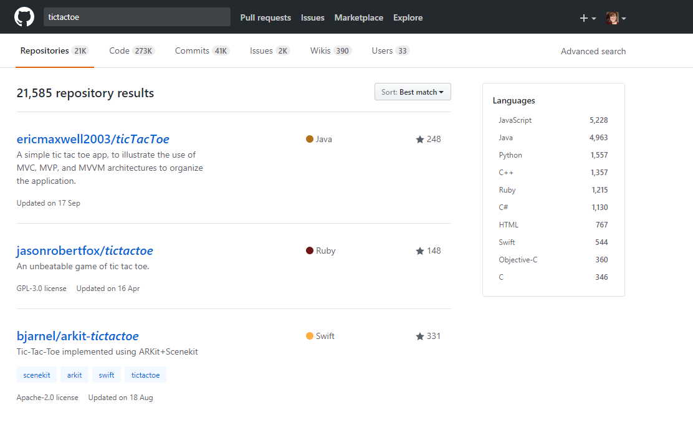

Identifica los elementos de navegación en los siguientes sites:

°Github
Es una pagina webque tiene un sistema de control de versiones muy popular, la mayoría de las empresas de tecnología ahora lo utilizan en su flujo de trabajo. Tambien posee una característica muy útil llamada GitHub pages, que te permite publicar el código del sitio en vivo en la Web.

Github presenta los siguientes tipos de navegacion:

Navegacion localizada: ya que presenta un buscador dentro de la pagina web.

Navegacion facetada: una vez que hemos introducido texto en el buscador nos salen una serie de referencias no editables de acuerdo a lo que estamos buscando.

Navegacion inline : o navegacion en linea esto lo podemos encontrar en la parte que subimos nuestro repositorio y creamos una rama en gh-pages para obtener el link de la pagina web que acabamos de crear, haciendo click en el link que se muestra nos llevara inmediatamente a la pagina web.
